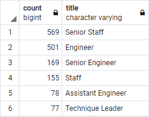

# Pewlett Hackard Analysis

## Overview of Project

### Purpose
To generate 2 tables; one with a list of the number of retiring employees by title, and another listing the employees that are eligible for the Mentorship Program

## Results
- Between 7 job titles, there are a total 90,398 potential retirees.
- Amongst the departments, there are 2 managers included in the total of potential retirees.
- There are only 1,549 employees eligible for the Mentorship Program, which is significantly less than the amount of employees potentially retiring.
- If more people retire than are eligble for the Mentorship, the company may want to re-consider eligibility requirements for the program. In my opinion, it would be better to promote internally than to hire externally immediately.

## Summary
As the "silver tsunami" begins to make an impact, a potential 90,398 roles will need to be filled. There are more than enough qualified, retirement-ready employees in the departments to mentor the next generation of employees.
If management wants to determine mentorship availability by job title, I created the query below that can be compared with the data found in the  spreadsheet.

If management takes my suggestion and expands the mentorship eligibility by 1 more year in age, 19,905 employees will be eligible for the program.
This can be seen in the new table I created 
Unfortunately the youngest employee was born in 1965, which was used for the original eligbility, so this problem will continue every year until younger employees are hired and obtain seniority with the company.